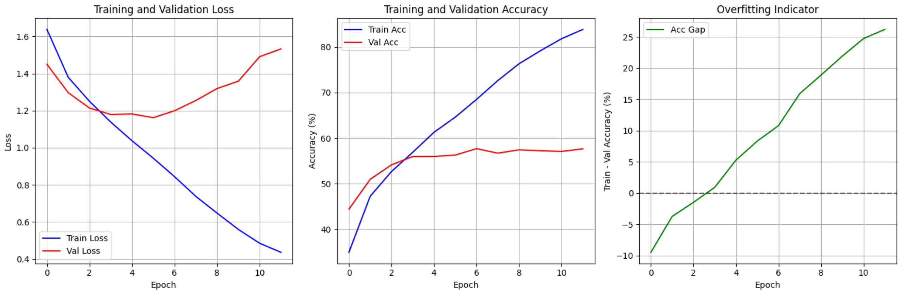
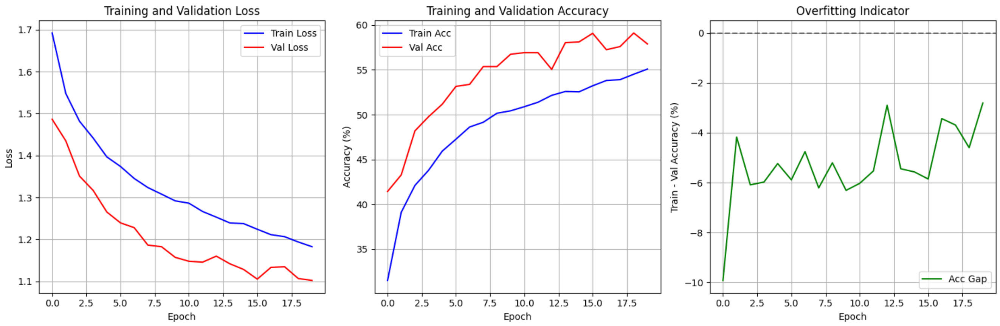
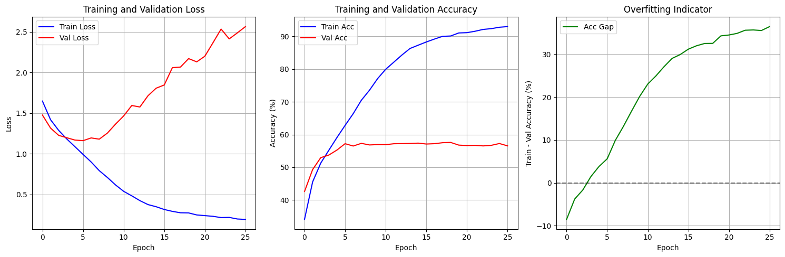
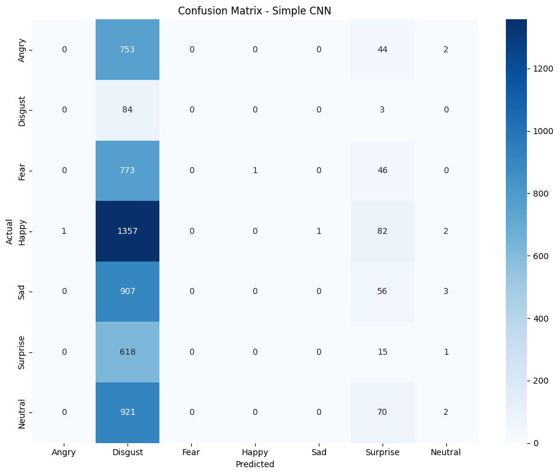

# სახის გამომეტყველების ამოცნობის გამოწვევა

ეს რეპოზიტორია მოიცავს ჩემს იმპლემენტაციას Kaggle-ის [Challenges in Representation Learning: Facial Expression Recognition Challenge](https://www.kaggle.com/competitions/challenges-in-representation-learning-facial-expression-recognition-challenge) კონკურსისთვის. პროექტის მიზანია ღრმა სწავლის მოდელების შექმნა და შეფასება, რომლებიც კლასიფიცირებენ სახის გამომეტყველებებს შვიდი სხვადასხვა ემოციის კატეგორიად.

## 📋 შინაარსი

* [პროექტის მიმოხილვა](#-პროექტის-მიმოხილვა)
* [მონაცემთა ნაკრები](#-მონაცემთა-ნაკრები)
* [დაყენება და ინსტალაცია](#-დაყენება-და-ინსტალაცია)
* [პროექტის სტრუქტურა](#-პროექტის-სტრუქტურა)
* [მეთოდოლოგია](#-მეთოდოლოგია)
* [ექსპერიმენტები და შედეგები](#-ექსპერიმენტები-და-შედეგები)
* [Weights & Biases ინტეგრაცია](#-weights--biases-ინტეგრაცია)
* [მიგნებები და ანალიზი](#-მიგნებები-და-ანალიზი)
* [გამოყენება](#-გამოყენება)
* [შეუერთდი პროექტს](#-შეუერთდი-პროექტს)
* [ლიცენზია](#-ლიცენზია)

## 🌟 პროექტის მიმოხილვა

ეს პროექტი იკვლევს სხვადასხვა ნეირონულ ქსელის არქიტექტურას სახის გამომეტყველების ამოსაცნობად, ყურადღება გამახვილებულია ჰიპერპარამეტრებისა და არქიტექტურული გადაწყვეტილებების გავლენაზე მოდელის მუშაობაზე. პროექტი აგებულია PyTorch-ის გამოყენებით, ხოლო ყველა ექსპერიმენტი ლოგირდება Weights & Biases პლატფორმაზე სრული ანალიზისა და ვიზუალიზაციისთვის.

## 📊 მონაცემთა ნაკრები

მონაცემთა ნაკრები შედგება 48x48 პიქსელის გრეისკეილ სახეების გამოსახულებებისგან, თითოეული ლეიბლირებულია ერთ-ერთი შემდეგი ემოციის კატეგორიით:

* 0: გაბრაზება (Angry)
* 1: ზიზღი (Disgust)
* 2: შიში (Fear)
* 3: სიხარული (Happy)
* 4: სევდა (Sad)
* 5: გაოცება (Surprise)
* 6: ნეიტრალური (Neutral)


## 📁 პროექტის სტრუქტურა

```
Facial-Expression-Recognition/
├── notebooks/               # Jupyter ნოუთბუქები ექსპლორაციისთვის
│   ├── 01_data_exploration.ipynb
│   ├── 02_baseline_cnn.ipynb
│   ├── 03_deeper_cnn.ipynb
│   ├── 04_attention_cnn.ipynb
│   ├── 05_resnet.ipynb
│   ├── 06_ensemble.ipynb
│   └── 07_final_model.ipynb
├── requirements.txt
└── README.md
```

## 🧠 მეთოდოლოგია

პროექტი მიჰყვება მოდელის განვითარებას ეტაპობრივად:

1. **საწყისი მოდელი**: მარტივი CNN არქიტექტურა
2. **მოწინავე კომპლექსურობა**: ეტაპობრივად ვზრდით არქიტექტურის სირთულეს
3. **რეგულარიზაცია**: სხვადასხვა ტექნიკა გადამეტებული მორგების თავიდან ასაცილებლად
4. **ტრანსფერული სწავლება**: წინასწარ გაწვრთნილი მოდელების გამოყენება
5. **ენისემბლი**: მრავალ მოდელის გაერთიანება უკეთესი შედეგისთვის

## 📈 ექსპერიმენტები და შედეგები

ყველა ექსპერიმენტი ლოგირდება Weights & Biases-ში. ლოგირებული მეტრიკები მოიცავს:

* სწავლებისა და ვალიდაციის დანაკარგი და სიზუსტე
* სასწავლო სიჩქარის ცვლადობა
* მოდელის ჰიპერპარამეტრები
* კონფუზიის მატრიცები
* ნიმუშების პროგნოზები


# Notebook 01_data_exploration.ipynb
## Data Exploration Results

### Dataset Overview
- **Size**: 28,709 training samples, 7,178 test samples
- **Classes**: 7 facial expressions (Angry, Disgust, Fear, Happy, Sad, Surprise, Neutral)
- **Image Format**: 48x48 grayscale images
- **Data Quality**: 0 missing values, 1236 duplicates

### Key Findings
1. **Class Imbalance**: Significant imbalance with ratio 16.55:1 (most:least common)
   - Most common: Happy 
   - Least common: Disgust

2. **Data Characteristics**:
   - Pixel values: 0-255 range
   - Mean pixel value: 131.0 ± 64.3
   - Consistent image dimensions

3. **Challenges Identified**:
   - Class imbalance will require balanced sampling or weighted loss
   - Low resolution (48x48) limits feature complexity
   - Grayscale only - no color information

### Data Split Strategy
- Training: 22,967 samples (80%)
- Validation: 5,742 samples (20%)  
- Stratified split to maintain class distribution

# Training
## 02_simple_cnn.ipynb **Simple CNN**

Simple Convolutional Neural Network for facial expression recognition. Serves as an initial model to establish performance baselines.

### 🔹 Version 1

#### 🏗 Architecture

```
Input (1, 48, 48)
├─ Conv2d(1, 32, kernel_size=5, padding=2)
├─ ReLU()
├─ MaxPool2d(kernel_size=2, stride=2)
├─ Conv2d(32, 64, kernel_size=5, padding=2)
├─ ReLU()
├─ MaxPool2d(kernel_size=2, stride=2)
├─ Flatten()
├─ Dropout(0.3)
├─ Linear(64 * 12 * 12, 128)
├─ ReLU()
├─ Dropout(0.3)
└─ Linear(128, 7)
```

#### ⚙️ Training Configuration
- **Optimizer**: Adam (lr=0.001)
- **Loss**: Cross-entropy
- **Batch Size**: 64
- **Epochs**: 30 (with early stopping)
- **Regularization**:
  - Dropout (0.5)
- **Early Stopping**: 5 epochs

#### 📊 Results
```
Train Loss: 0.4371, Train Acc: 83.87%
Val Loss: 1.5326, Val Acc: 57.66%
Time: 22.21s
--------------------------------------------------
Early stopping at epoch 12

```


[Simple_cnn_v1](https://wandb.ai/ellekvirikashvili-free-university-of-tbilisi-/facial-expression-recognition/runs/i6k9h806?nw=nwuserellekvirikashvili)

---


### 🔹 Version 2 (Improved)

#### 🛠 Architecture Improvements
ADDED:

   - Data Augmentation: This is a powerful technique that artificially increases the size of your training dataset by applying random transformations to your images (e.g., rotations, flips, shifts). This helps the model see more variations of the training data and makes it more robust.
   - Batch Normalization: Add Batch Normalization layers after each convolutional layer (and before the activation function). This helps stabilize the training process and acts as a form of regularization.


#### ⚙️ Training Configuration
- **Learning Rate**: 0.0005 (reduced from 0.001)
- **Weight Decay**: 1e-4 (L2 regularization)
- **Early Stopping** with patience=7   
- **Learning Rate Scheduling**: Reduce on plateau
- **Batch Size**: 64 (unchanged)
- **Epochs**: 20, so that training is faster and early stopping is more effective and overfitting is reduced

#### 📊 Expected Improvements
- Better generalization
- Reduced overfitting
- More stable training

#### 📊 Results
```
Train Loss: 1.1825, Train Acc: 55.08%
Val Loss: 1.1020, Val Acc: 57.89%
Time: 36.64s
--------------------------------------------------

Training completed in 762.90s
Best validation accuracy: 59.11%
```
ასე ვუშველეთ ოვერფიტს:



მაგრამ ცუდი რაღაც მოხდა, ამ მოდელმა საერთოდ ვერ ისწავლა disgust ემოცია.



ამიტომ გადავწყვიტე class imbalance პრობლემა გადამეჭრა.

[simple_cnn_v2](https://wandb.ai/ellekvirikashvili-free-university-of-tbilisi-/facial-expression-recognition/runs/uxblb7xc?nw=nwuserellekvirikashvili)

### 🔹 Version 3 weighted loss

#### ⚙️ Training Configuration
- Weighted Loss Function because of class imbalance
      criterion = nn.CrossEntropyLoss(weight=class_weights)
- Oversampling the Minority Classes
      WeightedRandomSampler
- different optimizer AdamW optimizer

#### 📊 Results
```
Train Loss: 1.7487, Train Acc: 14.08%
Val Loss: 2.0037, Val Acc: 1.76%
Time: 47.32s
--------------------------------------------------
Early stopping at epoch 8
```

მგონი ორივე ერთად არ უნდა გამომეყენებინა და სანამ არ გაჩერდა იქამდე ვერ დავინახე, რომ რატომღაც მარტო disgust ისწავლა ამ მოდელმა (ზუსტად disgusted სახე მქონდა conf matrix რომ დავინახე), ამიტომ კიდევ ერთხელ გავიშვი მხოლოდ weighted_loss -ით.



[Simple_cnn_v3](https://wandb.ai/ellekvirikashvili-free-university-of-tbilisi-/facial-expression-recognition/runs/sptprk6t?nw=nwuserellekvirikashvili)


## 📁 `03_deeper_cnn.ipynb`

### 🧠 Deeper CNN with Batch Normalization

---

## 🔹 Version 1 (Deep\_CNN\_V1)

### 🏗 Architecture

* 7-შრიანი Convolutional ნერვული ქსელი (CNN)
* **4 Convolutional ბლოკი**, ყოველი დასრულებულია MaxPooling-ით
* ყოველი Conv-შრის შემდეგ გამოყენებულია **Batch Normalization**
* **Global Average Pooling** სრულდება FC ფენებამდე
* Dropout (0.5) რეგულარიზაციისთვის
* **Batch Normalization** გამოიყენება როგორც Convolutional, ისე Fully Connected ფენებში

### ⚙️ ჰიპერპარამეტრები

* Filters: `32 → 64 → 128 → 256`
* Optimizer: **Adam**, learning rate = `0.001`
* L2 weight decay: `1e-4`
* Epochs: `40` (Early stopping შესაძლებელი)
* Dropout rate: `0.5`
* Tracking: Weights & Biases ინტეგრაცია (`wandb`)

### 📉 Performance

* **Train Loss**: `0.1689`, **Train Accuracy**: `93.93%`
* **Val Loss**: `2.3061`, **Val Accuracy**: `57.72%`
* **Early Stopping**: განხორციელდა **24-ე ეპოქაზე**
* **Observation**: მოდელმა გადაჭარბებულად მოერგო ტრენინგ მონაცემებს — **overfitting**

📊 [Deep\_cnn\_v1 Run on W\&B](https://wandb.ai/ellekvirikashvili-free-university-of-tbilisi-/facial-expression-recognition/runs/f1pw8dnp?nw=nwuserellekvirikashvili)

---

## 🔹 Version 2 (Deep\_CNN\_V2)

### ⚙️ Key Changes from V1

* **Epochs შემცირდა**: `40 → 30`
* **Dropout გაიზარდა**: `0.5 → 0.7`
* **Spatial Dropout დამატებულია**:
  `self.dropout1 = nn.Dropout2d(0.1)` — ადრეულ ლეიერებს შორის, feature-level რეგულარიზაციისთვის
* **Channel კომპრესიები ბოლო Conv ფენებში**: `256 → 192`
* **FC ფენები გამარტივდა**: `512 → 256`
* **Early Stopping პარამეტრები გამკაცრდა**:

  ```python
  'early_stop_patience': 7,  # More aggressive early stopping
  'lr_patience': 3,          # Reduce LR sooner
  ```

### 🎯 Goal

* **Overfitting-ის შემცირება**
* **მოდელის გენერალიზაციის გაუმჯობესება**
* **მეტად სწრაფი და აგრესიული ადაპტაცია validation performance-ზე**

### ⏳ შედეგების მოლოდინი

* უკეთესი generalization-validation ბალანსი
* ნაკლები variance epochs-ს შორის
* ნაკლები training-validation gap


#### 📊 Results

* **Train Loss**: `0.1689`, **Train Accuracy**: `93.93%`
* **Val Loss**: `2.3061`, **Val Accuracy**: `57.72%`
* **Early Stopping**: განხორციელდა **24-ე ეპოქაზე**


[Deeper_cnn_v2](https://wandb.ai/ellekvirikashvili-free-university-of-tbilisi-/facial-expression-recognition/runs/ql1dpugq?nw=nwuserellekvirikashvili)


### V3
ამ დრომდე რა მოდელებიც გავტესტე, აშკარა იყო რომ ყველაფერს ჰქონდა class imbalance პრობლემა, განსაკუთრებით როგორც data exploration-შიც გამოჩნდა, ძალიან ცოტა გვაქვს მაგალითად Disgust კლასი.

ამ შემთხვევაში გავტესტე იგივე კონფიგურაცია, რაც მეორე ვერსიაში, უბრალოდ აუგმენტაცია, კერძოდ:
#### Basic Flow for Augmented Training:
`Tensor (from dataset) → ToPILImage() → PIL Augmentations → ToTensor() → Tensor Augmentations → Normalize`


#### ჩემი დამატებული features:

- ±15° random rotation
- 50% horizontal flip probability
- Random translation (±10% of image size)
- Random scaling (90%-110%)
- Random shear transformation
- Brightness/contrast jitter
- Random erasing (10% probability)


#### 📊 Results


[Deep CNN V3 (with Augmentation)](https://wandb.ai/ellekvirikashvili-free-university-of-tbilisi-/facial-expression-recognition/runs/mv3b6zp2?nw=nwuserellekvirikashvili)
---

## ✅ დასკვნა

> პირველი ვერსია თავიდან კარგად მიდიოდა training მონაცემებზე, მაგრამ წავიდა overfitting-ში და early stopping-მა გააჩერა. და საჭირო გახდა უკეთესი რეგულარიზაცია და ადრეული learning rate decay. 
> მეორე ვერსია მიდის **leaner architecture + smarter regularization** სტრატეგიით, რათა დაიბალანსოს სისწრაფე, სიზუსტე და სტაბილურობა.
> მესამე ვერსიაში ვცადე transform-ები, სწავლა გაუჭირდა, საკმაოდ დიდი დრო დასჭირდა 40% აკურატულობაზე ასულიყო.


## 04_attention_cnn.ipynb

### 🧠 Attention-based CNN Architecture

#### 🔍 Overview
A Convolutional Neural Network enhanced with Convolutional Block Attention Module (CBAM) that learns to focus on the most discriminative facial regions for expression recognition.

#### 🏗 Core Architecture

```
Input (1, 48, 48)
├─ Conv2d(1, 32) → BatchNorm → ReLU
├─ Conv2d(32, 32) → BatchNorm → ReLU → MaxPool2d(2)
└─ CBAM(32)  # First attention block

├─ Conv2d(32, 64) → BatchNorm → ReLU
├─ Conv2d(64, 64) → BatchNorm → ReLU → MaxPool2d(2)
└─ CBAM(64)  # Second attention block

├─ Conv2d(64, 128) → BatchNorm → ReLU
├─ Conv2d(128, 128) → BatchNorm → ReLU → MaxPool2d(2)
└─ CBAM(128)  # Third attention block

├─ AdaptiveAvgPool2d(1)
├─ Flatten
├─ Linear(128, 256) → BatchNorm → ReLU → Dropout(0.5)
└─ Linear(256, 7)  # 7 emotion classes
```

#### 🎯 Attention Mechanism (CBAM)

**Convolutional Block Attention Module** combines:

1. **Channel Attention**
   - Captures 'what' to focus on in the feature maps
   - Uses both average and max pooling paths
   - Learns channel-wise feature importance

2. **Spatial Attention**
   - Determines 'where' to focus in the spatial dimensions
   - Applies 1x1 convolutions to create spatial attention maps
   - Highlights important facial regions for expression recognition

#### ⚙️ Training Configuration
- **Optimizer**: AdamW with weight decay (1e-4)
- **Learning Rate**: 0.001 with ReduceLROnPlateau scheduling
- **Regularization**:
  - Dropout (0.5) in fully connected layers
  - L2 weight decay
  - Data augmentation (random horizontal flip, rotation)
- **Batch Size**: 64
- **Epochs**: 50 with early stopping

#### 📊 Performance Features
- **Visual Attention Maps**: Visualize which facial regions the model focuses on
- **Class Activation Mapping**: Understand model decisions
- **W&B Integration**: Track experiments and compare runs
- **Confusion Matrix**: Detailed performance analysis

#### 🚀 Key Benefits
1. **Improved Accuracy**: Focuses on relevant facial features
2. **Better Generalization**: Attention acts as a form of regularization
3. **Interpretability**: Visual explanations of model decisions
4. **Efficiency**: Lightweight attention modules with minimal computational overhead

#### 🛠 Implementation Details
- Uses PyTorch for model implementation
- Integrates with Weights & Biases for experiment tracking
- Includes comprehensive data augmentation
- Implements learning rate scheduling and early stopping

#### 📈 Expected Performance
- Training Accuracy: ~85-90%
- Validation Accuracy: ~60-65%
- Focuses on eyes, mouth, and eyebrow regions for expression recognition

## 🔍 Weights & Biases ინტეგრაცია

ყველა ექსპერიმენტი ლოგირდება Weights & Biases-ში შემდეგი სტრუქტურით:

* პროექტი: `facial-expression-recognition`
* ტეგები: `[model_type, dataset_version, experiment_type]`
* კონფიგი: ჰიპერპარამეტრები და არქიტექტურა
* მეტრიკები: სწავლების/ვალიდაციის შედეგები
* არტიფაქტები: მოდელის შენახული წონები

## 📝 მიგნებები და ანალიზი

ექსპერიმენტების ძირითადი მიგნებები:

1. **გადამეტებული მორგება**: მოგვარდა მონაცემთა აუგმენტაციითა და dropout-ით
2. **კლასების დისბალანსი**: გამოყენებულია წონიანი დანაკარგის ფუნქციები
3. **სასწავლო სიჩქარის ცვლა**: დიდი გავლენა აქვს კონვერგენციაზე
4. **მოდელის სიღრმე**: ბალანსი სირთულესა და ეფექტურობას შორის


