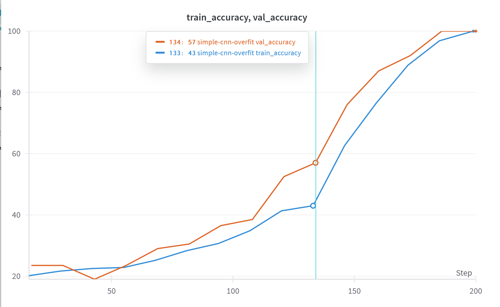
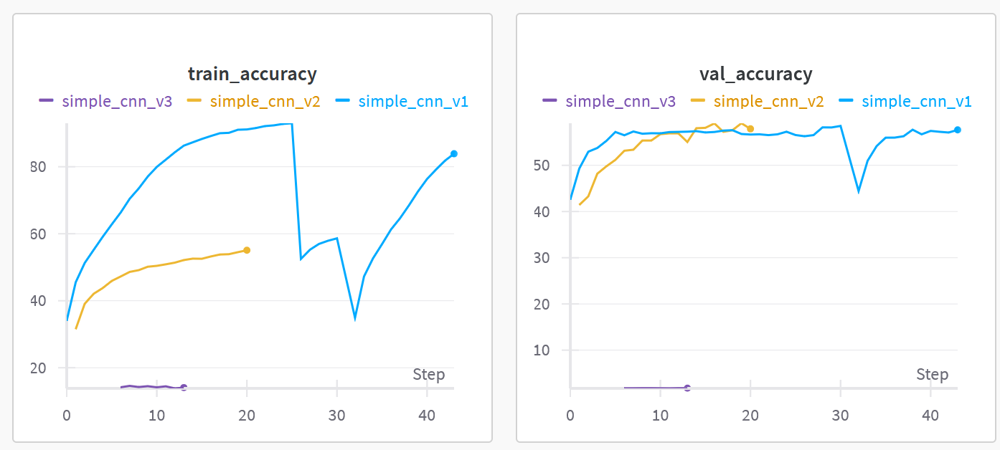
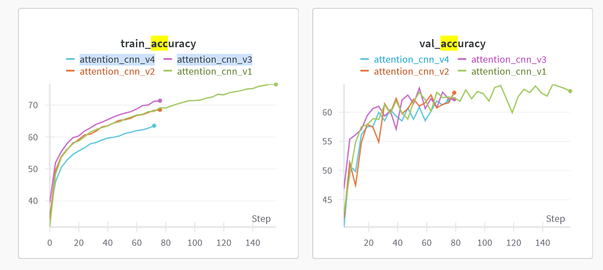
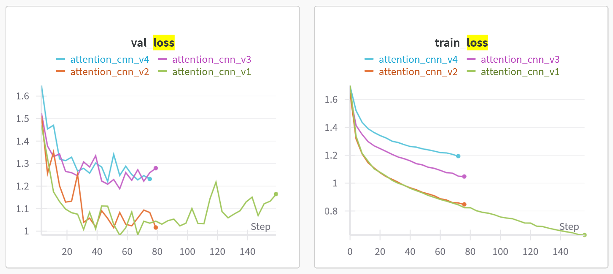
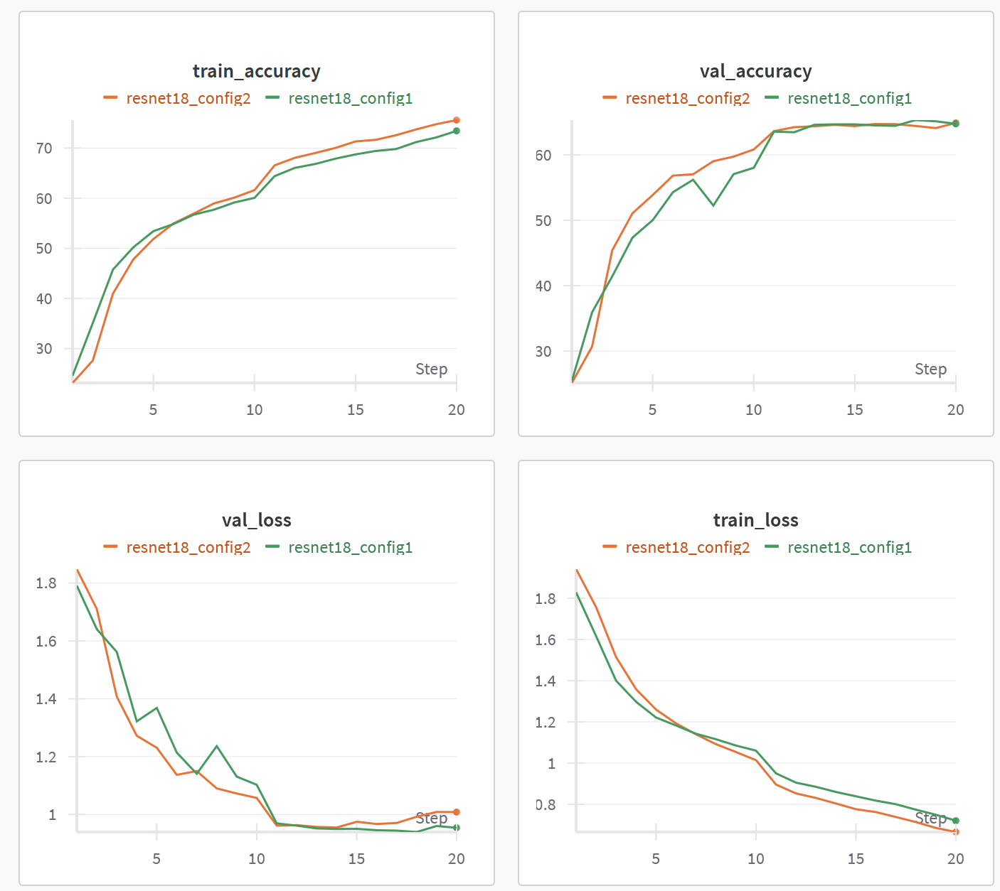
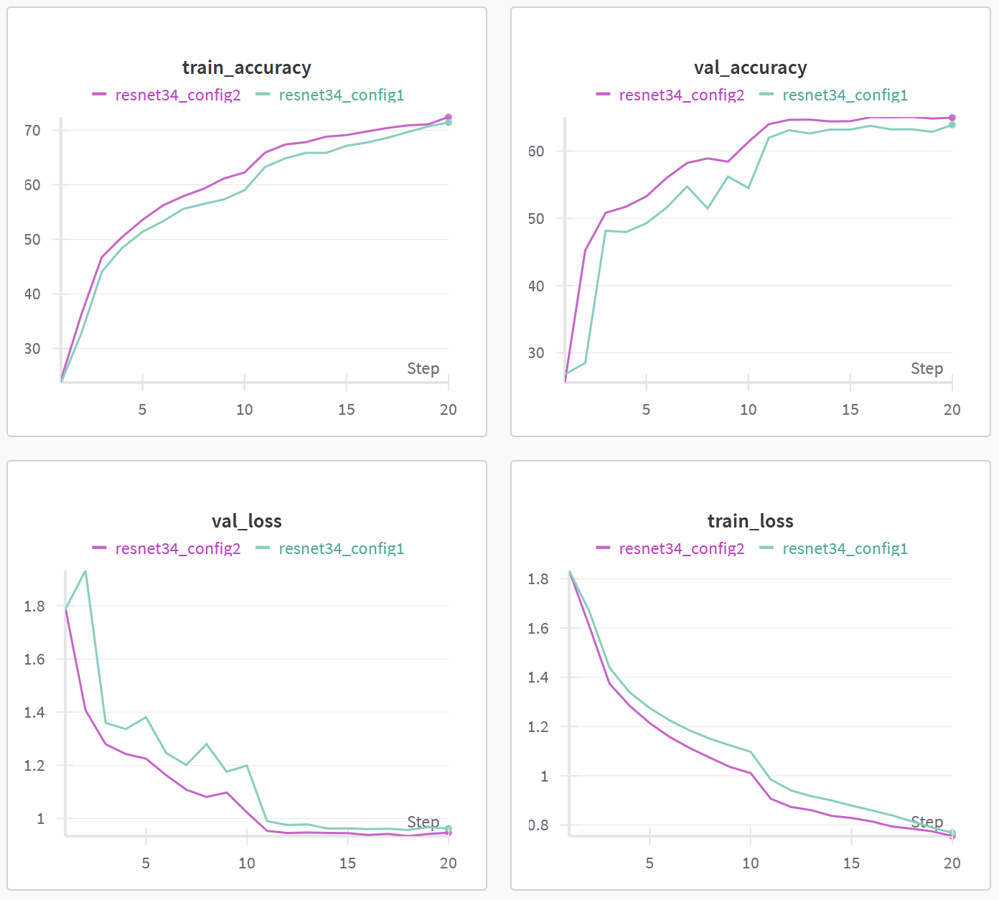
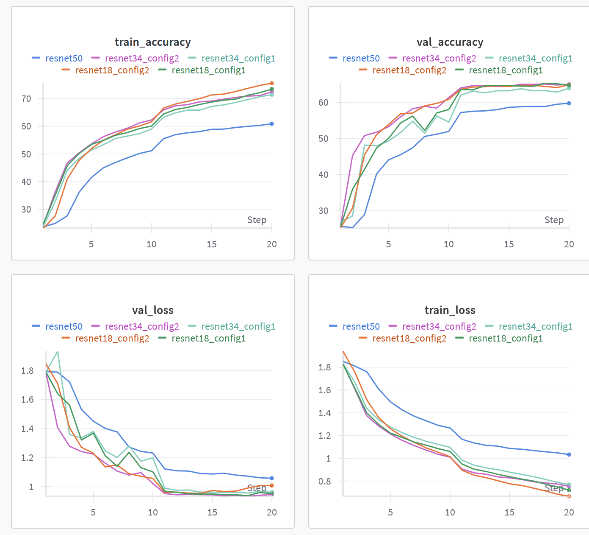

# სახის გამომეტყველების ამოცნობის გამოწვევა

ეს რეპოზიტორია მოიცავს ჩემს იმპლემენტაციას Kaggle-ის [Challenges in Representation Learning: Facial Expression Recognition Challenge](https://www.kaggle.com/competitions/challenges-in-representation-learning-facial-expression-recognition-challenge) კონკურსისთვის. პროექტის მიზანია deep learning მოდელების შექმნა და შეფასება, რომლებიც შეძლებენ 7 განსხვავებული ემოციის ამოცნობას.


## 📁 პროექტის სტრუქტურა

```
Facial-Expression-Recognition/
├── notebooks/               
│   ├── 01_data_exploration.ipynb
│   ├── 02_simple_cnn.ipynb
│   ├── 03_deeper_cnn.ipynb
│   ├── 04_attention_cnn.ipynb
│   ├── 05_resnet.ipynb
│   ├── 06_vit_transformer.ipynb
│   └── 07_final_model.ipynb
├── requirements.txt
└── README.md
```

## 🧠 მიდგომა
1. **baseline მოდელი**: მარტივი CNN არქიტექტურა, ვიწყებთ მარტივად დაოვერფიტებით
2. **deeper architecture**: ეტაპობრივად ვზრდით არქიტექტურის სირთულეს და მოდელის კომპლექსურობას
3. **regularization**: სხვადასხვა ტექნიკა overfitting ასაცილებლად
4. **transfer learning**: წინასწარ გაწვრთნილი მოდელების გამოყენება (vit)
5. **ensemble**: განსხვავებული მოდელების გაერთიანება უკეთესი შედეგისთვის


# Notebook 01_data_exploration.ipynb
## მონაცემთა ანალიზის შედეგები

### მონაცემთა მიმოხილვა

* **კლასები**: 7 სახის გამომხატველი ემოცია (Angry, Disgust, Fear, Happy, Sad, Surprise, Neutral)
* **სურათის ფორმატი**: 48x48 გრეისქეილის (black and white) გამოსახულებები

### შეფასება

1. **კლასების დისბალანსი**: მნიშვნელოვანი დისბალანსი თანაფარდობით 16.55:1 (ყველაზე ხშირად:ყველაზე იშვიათად)

   * ყველაზე გავრცელებული: Happy  
   * ყველაზე იშვიათი: Disgust

2. **მონაცემთა მახასიათებლები**:

   * პიქსელების მნიშვნელობები: დიაპაზონში 0-დან 255-მდე
   * საშუალო პიქსელური მნიშვნელობა: 131.0 ± 64.3
   * გამოსახულების ზომები მუდმივია

3. **იდენტიფიცირებული სირთულეები**:

   * კლასების დისბალანსი მოითხოვს დაბალანსებულ შერჩევას ან წონად loss ფუნქციას
   * დაბალი რეზოლუცია (48x48) ზღუდავს თვისებათა სირთულის სწავლას
   * მხოლოდ შავ-თეთრი გამოსახულებები — არ არსებობს ფერების ინფორმაცია


# Training
## 02_simple_cnn.ipynb **Simple CNN**

დავიწყე ძალიან მარტივი არქიტექტურით და ნელ-ნელა დავამატე ლეიერები, რეგულარიზაცია, ნორმალიზაცია და ა.შ.  


### Baseline - check overfitting
თავიდან დავწერე უმარტივესი 1 ლეიერიანი მოდელი, რომელზეც გადავაოვერფიტებდი და არქიტექტურას შევამოწმებდი. დავატრენინგე მხოლოდ 200 sample-ზე, და ერთი და იგივე validation da train სეტები გამოვიყენე.

```
┌───────────────────────────────────────────────────────────┐
│                      SimpleCNN Architecture               │
├────────────────┬──────────────────────────────────────────┤
│ Layer          │ Output Shape        │ Parameters         │
├────────────────┼────────────────────┼─────────────────────┤
│ Input          │ (1, 48, 48)        │ 0                   │
│ Conv2d         │ (64, 48, 48)       │ 640                 │
│   (3x3, pad=1) │                    │                     │
│ ReLU           │ (64, 48, 48)       │ 0                   │
│ MaxPool2d      │ (64, 24, 24)       │ 0                   │
│   (2x2)        │                    │                     │
│ Flatten        │ (36864)            │ 0                   │
│ Linear         │ (128)              │ 4,718,720           │
│ ReLU           │ (128)              │ 0                   │
│ Linear         │ (7)                │ 903                 │
└────────────────┴────────────────────┴─────────────────────┘

Total Parameters: 4,720,263
Trainable Parameters: 4,720,263
```

უკვე 13 ეპოქაზე წავიდა ოვერფიტში.
```
Epoch 13: Validation Loss: 0.0805, Validation Acc: 100.00%
Epoch [14/100]
Train Loss: 0.1801, Train Acc: 96.83%
Val Loss: 0.0805, Val Acc: 100.00%
``` 




### 🔹 Version 1 Deep CNN
#### 🏗 Architecture

გვაქვს 2 შრიანი არქიტექტურა დროფაუთით.

```
Input (1, 48, 48)
├─ Conv2d(1, 32, kernel_size=5, padding=2)
├─ ReLU()
├─ MaxPool2d(kernel_size=2, stride=2)
├─ Conv2d(32, 64, kernel_size=5, padding=2)
├─ ReLU()
├─ MaxPool2d(kernel_size=2, stride=2)
├─ Flatten()
├─ Dropout(0.3)
├─ Linear(64 * 12 * 12, 128)
├─ ReLU()
├─ Dropout(0.3)
└─ Linear(128, 7)
```

#### ⚙️ Training Configuration
- **Optimizer**: Adam (lr=0.001)
- **Loss**: Cross-entropy
- **Batch Size**: 64
- **Epochs**: 30 (with early stopping)
- **Regularization**:
  - Dropout (0.5)
- **Early Stopping**: 5 epochs

#### 📊 Results
ესეც წავიდა ოვერფიტში და გააჩერა early stopping-მა. ამიტომ შემდეგი ექსპერიმენტი უფრო დიდი დროფაუთით ვცადე.
```
Train Loss: 0.4371, Train Acc: 83.87%
Val Loss: 1.5326, Val Acc: 57.66%
Time: 22.21s
--------------------------------------------------
Early stopping at epoch 12

```


[Simple_cnn_v1](https://wandb.ai/ellekvirikashvili-free-university-of-tbilisi-/facial-expression-recognition/runs/i6k9h806?nw=nwuserellekvirikashvili)

---


### 🔹 Version 2 (Improved Deep CNN)

#### 🛠 Architecture Improvements

მინდოდა წეღანდელი ოვერფიტისთვის მეშველა და დავამატე ეს features:

* **Data Augmentation**: შემთხვევითი ტრანსფორმაციების გამოყენება სურათებზე, რათა მოდელს შეეძლოს უკეთ გენერალიზაცია.
* **Batch Normalization**: ბეჩ ნორმალიზაციის ფენები დაემატა ყოველი კონვოლუციური ფენის შემდეგ (აქტივაციის ფუნქციამდე). ეს სტაბილურობას მატებს სწავლების პროცესს და მოქმედებს როგორც რეგულარიზაციის ერთ-ერთი ფორმა.

#### ⚙️ Training Configuration

* **Learning Rate**: 0.0005 (შემცირდა 0.001-დან)
* **Weight Decay**: 1e-4 (L2 Regularization)
* **Early Stopping**:  7
* **Learning Rate Decay**: მცირდება პლატოზე გასვლისას
* **Batch Size**: 64 (უცვლელი)
* **Epochs**: 20 — სწავლა უფრო სწრაფია, Early Stopping უფრო ეფექტურად მუშაობს და ოვერფიტინგი მცირდება
* **Dropout**: 0.4


#### 📊 Results
```
Train Loss: 1.1825, Train Acc: 55.08%
Val Loss: 1.1020, Val Acc: 57.89%
Time: 36.64s
--------------------------------------------------

Training completed in 762.90s
Best validation accuracy: 59.11%
```
უცნაური შედეგი მივიღეთ, ვალიდაციაზე უკეთესი შედეგი ჰქონდა ვიდრე ტრეინ სეტზე, მაგრამ ნუ ასე ვუშველეთ ოვერფიტს

 მაგრამ ფაქტია ეს მოდელი კარგი არაა და ზედმეტი მომივიდა პარამეტრების გადარჩევისას, შესაძლოა უფრო მეტ ეპოქაზე უკეთესი შედეგი დაედო მაგრამ ცოტა ნაკლებად მკაცრი კონფიგურაცია გავუწერე შემდეგებს.
მაგრამ ცუდი რაღაც მოხდა, ამ მოდელმა საერთოდ ვერ ისწავლა disgust ემოცია.


ამიტომ გადავწყვიტე class imbalance პრობლემა გადამეჭრა.

[simple_cnn_v2](https://wandb.ai/ellekvirikashvili-free-university-of-tbilisi-/facial-expression-recognition/runs/uxblb7xc?nw=nwuserellekvirikashvili)

--- 

### 🔹 Version 3 — ვუშველოთ class imbalance პრობლემას

#### ⚙️ კონფიგურაცია

* **Weighted Loss Function** კლასების დაულანსებლობის გამო
  `criterion = nn.CrossEntropyLoss(weight=class_weights)`
  → ეს აძლევს მეტ მნიშვნელობას შედარებით ნაკლებად განმეორებულ კლასებს, რომ არ მიიჩქმალონ ტრენინგის პროცესში.

* **Oversampling**
  `WeightedRandomSampler`

* **AdamW**
  → ადაპტიური სწავლის სიჩქარით და უფრო სტაბილური სწავლება.

#### 📊 Results
```
Train Loss: 1.7487, Train Acc: 14.08%
Val Loss: 2.0037, Val Acc: 1.76%
Time: 47.32s
--------------------------------------------------
Early stopping at epoch 8
```

მგონი კლასების დაბალანსების გზები ორივე ერთად არ უნდა გამომეყენებინა და სანამ არ გაჩერდა იქამდე ვერ დავინახე, რომ რატომღაც მარტო disgust ისწავლა ამ მოდელმა (ზუსტად disgusted სახე მქონდა conf matrix რომ დავინახე) ან შესაძლოა რაღაც ძალიან არასწორად გავაკეთე კოდში.


[Simple_cnn_v3](https://wandb.ai/ellekvirikashvili-free-university-of-tbilisi-/facial-expression-recognition/runs/sptprk6t?nw=nwuserellekvirikashvili)


### შედარება:



## 📁 `03_deeper_cnn.ipynb`

### 🧠 Deeper CNN with Batch Normalization

---

## 🔹 Version 1 (Deep\_CNN\_V1)

### 🏗 Architecture

* 7-შრიანი Convolutional ნერვული ქსელი (CNN)
* **4 Convolutional ბლოკი**, ყოველი დასრულებულია MaxPooling-ით
* ყოველი Conv-შრის შემდეგ გამოყენებულია **Batch Normalization**
* **Global Average Pooling** FC ფენებამდე
* Dropout (0.5) რეგულარიზაციისთვის
* **Batch Normalization** გამოიყენება როგორც Convolutional, ისე Fully Connected ფენებში

### ⚙️ ჰიპერპარამეტრები

* Filters: `32 → 64 → 128 → 256`
* Optimizer: **Adam**, learning rate = `0.001`
* L2 weight decay: `1e-4`
* Epochs: `40` (Early stopping შესაძლებელი)
* Dropout rate: `0.5`
* Tracking: Weights & Biases ინტეგრაცია (`wandb`)

### 📊 Results

* **Train Loss**: `0.1689`, **Train Accuracy**: `93.93%`
* **Val Loss**: `2.3061`, **Val Accuracy**: `57.72%`
* **Early Stopping**: გააჩერა **24-ე ეპოქაზე**
* **Observation**:  **overfitting**

📊 [Deep\_cnn\_v1 Run on W\&B](https://wandb.ai/ellekvirikashvili-free-university-of-tbilisi-/facial-expression-recognition/runs/f1pw8dnp?nw=nwuserellekvirikashvili)

---

## 🔹 Version 2 (Deep\_CNN\_V2)

### ⚙️ Key Changes from V1

* **Epochs შემცირდა**: `40 → 30`
* **Dropout გაიზარდა**: `0.5 → 0.7`
* **Spatial Dropout დამატებულია**:
  `self.dropout1 = nn.Dropout2d(0.1)` — ადრეულ ლეიერებს შორის, feature-level რეგულარიზაციისთვის
* **Channel კომპრესიები ბოლო Conv ფენებში**: `256 → 192`
* **FC ფენები გამარტივდა**: `512 → 256`
* **Early Stopping პარამეტრები გამკაცრდა**:

  ```python
  'early_stop_patience': 5,  # More aggressive early stopping
  'lr_patience': 3,          # Reduce LR sooner
  ```

### 🎯 Goal

* **Overfitting-ის შემცირება**
* **მოდელის გენერალიზაციის გაუმჯობესება**
* **მეტად სწრაფი და აგრესიული ადაპტაცია validation performance-ზე**

### ⏳ შედეგების მოლოდინი

* უკეთესი generalization-validation ბალანსი
* ნაკლები variance epochs-ს შორის
* ნაკლები training-validation gap


#### 📊 Results
* **Train Loss**: `0.1689`, **Train Accuracy**: `93.93%`
* **Val Loss**: `2.3061`, **Val Accuracy**: `57.72%`
* **Early Stopping**: განხორციელდა **24-ე ეპოქაზე**

ძალიან ოვერფიტში წავიდა ეს მოდელიც. 

[Deeper_cnn_v2](https://wandb.ai/ellekvirikashvili-free-university-of-tbilisi-/facial-expression-recognition/runs/ql1dpugq?nw=nwuserellekvirikashvili)


## 🔹 Version 3 (Deep CNN V3)

ამ დრომდე რა მოდელებიც გავტესტე, აშკარა იყო რომ ყველაფერს ჰქონდა class imbalance პრობლემა, განსაკუთრებით როგორც data exploration-შიც გამოჩნდა, ძალიან ცოტა გვაქვს მაგალითად Disgust კლასი.

ამ შემთხვევაში გავტესტე იგივე კონფიგურაცია, რაც მეორე ვერსიაში, უბრალოდ აუგმენტაცია დავამატე, კერძოდ:

#### Basic Flow for Augmented Training:
`Tensor (from dataset) → ToPILImage() → PIL Augmentations → ToTensor() → Tensor Augmentations → Normalize`


#### ჩემი დამატებული features:

- ±15° random rotation
- 50% horizontal flip probability
- Random translation (±10% of image size)
- Random scaling (90%-110%)
- Random shear transformation
- Brightness/contrast jitter
- Random erasing (10% probability)


#### 📊 Results 
- Train Accuracy: `51%`
- Val Accuracy: `55%`
რაც უცნაური შედეგია, როგორც ჩანს აუგმენტაციამ ან ვერ უშველა, ან ვერ ისწავლა feature-ები და მეტი ეპოქა სჭირდება. 

[Deep CNN V3 (with Augmentation)](https://wandb.ai/ellekvirikashvili-free-university-of-tbilisi-/facial-expression-recognition/runs/mv3b6zp2?nw=nwuserellekvirikashvili)
---

## ✅ დასკვნა

> პირველი ვერსია თავიდან კარგად მიდიოდა training მონაცემებზე, მაგრამ წავიდა overfitting-ში და early stopping-მა გააჩერა. და საჭირო გახდა უკეთესი რეგულარიზაცია და ადრეული learning rate decay. 
> მეორე ვერსია მიდის **leaner architecture + smarter regularization** სტრატეგიით, რათა დაიბალანსოს სისწრაფე, სიზუსტე და სტაბილურობა.
> მესამე ვერსიაში ვცადე transform-ები, სწავლა გაუჭირდა, საკმაოდ დიდი დრო დასჭირდა 40% აკურატულობაზე ასულიყო.

---

# **04\_attention\_cnn.ipynb – AttentionCNN
## Version 1 **AttentionCNN\_v1**

#### 🔍 მიმოხილვა

ეს არის კონვოლუციური ნეირონული ქსელი, რომელსაც დამატებული აქვს ყურადღების მოდული – **CBAM** (Convolutional Block Attention Module), რათა სურათიდან ყველაზე მნიშვნელოვანი სახის ნაწილები ამოარჩიოს ემოციის ამოსაცნობად.

---

### 🏗 არქიტექტურა

```
┌─ Conv2d(1, 32) → BatchNorm → ReLU  
├─ Conv2d(32, 32) → BatchNorm → ReLU → MaxPool2d(2)  
└─ CBAM(32)  ← პირველი ყურადღების ბლოკი

┌─ Conv2d(32, 64) → BatchNorm → ReLU  
├─ Conv2d(64, 64) → BatchNorm → ReLU → MaxPool2d(2)  
└─ CBAM(64)  ← მეორე ყურადღების ბლოკი

┌─ Conv2d(64, 128) → BatchNorm → ReLU  
├─ Conv2d(128, 128) → BatchNorm → ReLU → MaxPool2d(2)  
└─ CBAM(128)  ← მესამე ყურადღების ბლოკი

→ AdaptiveAvgPool2d(1)  
→ Flatten  
→ Linear(128 → 256) → BatchNorm → ReLU → Dropout(0.5)  
→ Linear(256 → 7) ← 7 ემოციის კლასიფიკაცია  
```

---

### 🎯 ყურადღების მექანიზმი – CBAM

CBAM ორ კომპონენტს აერთიანებს:

1. **Channel Attention**
   👉 ეუბნება მოდელს *“რა”* გაამახვილოს ყურადღება — რომელი არხებია უფრო მნიშვნელოვანი.

2. **Spatial Attention**
   👉 აჩვენებს *“სად”* უნდა ფოკუსირდეს — სახის რომელი წერტილებია გამოსადეგი ემოციის ამოსაცნობად.

---

### ⚙️ სწავლების კონფიგურაცია

* **optimizer**: AdamW (weight decay = 1e-4)
* **learning rate**: 0.001, პლატოს შემთხვევაში ავტომატური შემცირება
* **regularization**:

  * Dropout 0.5
  * L2 წონის დაჯარიმება
  * Data augmentation (შემობრუნება, როტაცია)
* **Batch Size**: 64
* **Epochs**: 50 + early stopping

---

### 🚀 ძირითადი უპირატესობები

1. **accuracy** – attention ეხმარება სწორ feature-ებზე ყურადღების გამახვილებაში
2. **generalization** – attention ამცირებს overfitting-ს
3. **visualisation** – შესაძლებელი ხდება ვიზუალური ახსნა, თუ რატომ მიიღო მოდელმა ესა თუ ის გადაწყვეტილება და ტრენინგის ეტაპზე შესაძლებელია ვიზუალიზაციის დანახვა, რას აქცევს ყურადღებას მოდელი
4. **CBAM** – CBAM მსუბუქია და არ ტვირთავს ბევრად გამოთვლით რესურსებს


#### 📊 Results
- Training Accuracy: 76%
- Validation Accuracy: 63%
განსხვავება საკმაოდ დიდია ამ ორ მონაცემს შორის და გვაქვს overfitting. შემდეგ run-ში ვეცადე გამომესწორებინა overfitting.

[Attention V1](https://wandb.ai/ellekvirikashvili-free-university-of-tbilisi-/facial-expression-recognition/runs/4a37ougz?nw=nwuserellekvirikashvili)


## Version 2 **AttentionCNN_v2**
epochs-ის რაოდენობა შევამცირე, რადგან ბევრ ეპოქაზე პლატოზე გადიოდა და უბრალოდ overfitting-ში მიდიოდა. 40 ეპოქიდან შევამცირე 20 ეპოქაზე. ასევე, batch_size=128 გავუშვი, მაინტერესებდა, როგორ დასძლევდა ცოტა დიდ ბეჩს. შევუცვალე learning_rate=0.0005. მივიღე შედეგები: 
val_acc : 63%
train_acc:  68%
overfitting-ს ეშველა. ახლა ვეცადე სხვა პარამეტრები შემეცვალა.

[Attention V2](https://wandb.ai/ellekvirikashvili-free-university-of-tbilisi-/facial-expression-recognition/runs/30aso492?nw=nwuserellekvirikashvili)


## Version 3 **AttentionCNN_v3**
შევეცადე, რამდენიმე პარამეტრი ერთად შემეცვალა და მენახა შედეგი.
### ძირითადი პარამეტრები:


| პარამეტრი             | მნიშვნელობა | ახსნა / მოტივაცია                                                                                  |
| --------------------- | ----------- | -------------------------------------------------------------------------------------------------- |
| **batch\_size**       | 64          | მცირე batch-ი აუმჯობესებს გენერალიზაციას და ამცირებს გადატრენინგების რისკს.                        |
| **learning\_rate**    | 3e-4        | დაბალი learning rate უზრუნველყოფს სტაბილურობას, რაც მნიშვნელოვანია ყურადღების მქონე მოდელებისთვის. |
| **epochs**            | 50          | მეტი ეპოქა უკეთ აასწავლის გამომეტყველებების ნიუანსებს.                                             |
| **weight\_decay**     | 5e-4        | ძლიერი რეგულარიზაცია საჭიროა კომპლექსური ყურადღების მოდულებისთვის.                                 |
| **dropout\_rate**     | 0.3         | ნაკლები dropout საკმარისია, რადგან ყურადღების მექანიზმი (CBAM) უკვე ახდენს ხმაურის შეზღუდვას.      |
| **label\_smoothing**  | 0.1         | იცავს მოდელს გადაჭარბებული თავდაჯერებულობისგან და აუმჯობესებს ზოგად შედეგებს.                      |
| **scheduler\_T\_max** | 10          | Cosine scheduler გლუვად ამცირებს learning rate-ს, რაც აუმჯობესებს კონვერგენციას.                   |


მაგრამ მაინც დიდად ვერ უშველა, overfitting-ში წავიდა და საბოლოო შედეგი იყო: 
- Training Accuracy: 71%
- Validation Accuracy: 62%
კიდევ ვცადე attention-ის პარამტრების ტუნინგი.


[Attention V3](https://wandb.ai/ellekvirikashvili-free-university-of-tbilisi-/facial-expression-recognition/runs/j96barvg)


---

## Version 4 **AttentionCNN_v4**
| Change                  | Why?                                                          |
| ----------------------- | ------------------------------------------------------------- |
| Label smoothing loss    | Prevents overconfident predictions                            |
| Smaller batch size (64) | Adds noise/regularization improving generalization            |
| Lower learning rate     | Stable fine-tuning of attention layers                        |
| Longer epochs (50)      | Give model enough time, but early stopping stops overtraining |
| Weight decay increased  | Stronger L2 regularization                                    |
| Dropout reduced to 0.3  | Attention modules already regularize well                     |
| Early stopping          | Stops training once validation no longer improves             |

ეს მოდელი გააჩერა Early Stopping-მა 19/30 ეპოქაზე: 
```
Epoch 19/30 [Train]: 100%|██████████| 359/359 [00:43<00:00,  8.34it/s, loss=1.19, acc=63.5]
204
2025-06-03 14:50:29
Evaluating: 100%|██████████| 90/90 [00:04<00:00, 20.97it/s]
205
2025-06-03 14:50:33
Validation Loss: 1.2319, Accuracy: 61.98%
206
2025-06-03 14:50:33
EarlyStopping counter: 7 out of 7
207
2025-06-03 14:50:33
Early stopping triggered. Stopping training.
208
2025-06-03 14:56:03
Final evaluation...
```
მაგრამ ამ მოდელმა ასევე ვერ ისწავლა კლასი disgust. 
#### Results:
- Training Accuracy: 63%
- Validation Accuracy: 61%

#### შეჯამება
ყველაზე მეტად მომეწონა ვერსია 2. მიუხდავად იმისა, რომ უფრო სტაბილური და ახლო-ახლო შედეგები აქვს v4-ს, თუმცა ამ მოდელმა ასევე ვერ ისწავლა disgust კლასი. 
ამიტომ, ვფიქრობ v2 ნამდვილად იმსახურებს საბოლოო მოდელში ensembling-ს.




## 05_resnet.ipynb

შემდეგ გავტესტე ResNet-ის არქიტექტურა სხვადასხვა კონფიგურაციებით და ტრენინგის სტრატეგიებით, კერძოდ 
Resnet18, resnet34 და resnet50 არქიტექტურები. ამ არქიტექტურებს სახელების მიხედვით განასხვავებთ ფენების რაოდენობა 
რა მაგარია, რომ ქართულად გინდა! აი მარტივი შედარება ResNet-18-ის, ResNet-34-ის და ResNet-50-ის შორის:

| მახასიათებელი            | **ResNet-18**     | **ResNet-34**   | **ResNet-50**         |
| ------------------------ | ----------------- | --------------- | --------------------- |
| ფენების რაოდენობა        | 18                | 34              | 50                    |
| ბლოკების ტიპი            | Basic Block       | Basic Block     | **Bottleneck Block**  |
| პარამეტრები (დაახლოებით) | 11.7 მილიონი      | 21.8 მილიონი    | 25.6 მილიონი          |


---

### ✨ ძირითადი განსხვავებები:

* **ResNet-18** – მსუბუქია და სწრაფი
* **ResNet-34** – უფრო ღრმა და უფრო ზუსტი
* **ResNet-50** – იყენებს სპეც. ბლოკებს (Bottleneck), რაც სიღრმეს და სიზუსტეს ზრდის


### 🔧 Tested Architectures

1. **ResNet18** 
   - **Configuration 1**:
     - Batch Size: 64
     - Learning Rate: 0.001
     - Optimizer: Adam
     - Dropout: 0.3
     - Weight Decay: 1e-4
     - **Results**:
       - Test Accuracy: 65.31%
       - F1 Macro: 0.604
       - Training Accuracy: 73.43%
       - Validation Accuracy: 64.73%
       - [Wandb: ResNet18 Configuration 1](https://wandb.ai/ellekvirikashvili-free-university-of-tbilisi-/facial-expression-recognition/runs/6fevr4sx)
   - **Configuration 2**:
     - Batch Size: 32
     - Learning Rate: 0.01
     - Optimizer: SGD
     - Dropout: 0.5
     - **Results**:
       - Test Accuracy: 64.87%
       - F1 Macro: 0.606
       - Training Accuracy: 75.58%
       - Validation Accuracy: 64.87%
       - [Wandb: ResNet18 Configuration 2](https://wandb.ai/ellekvirikashvili-free-university-of-tbilisi-/facial-expression-recognition/runs/62mn0jg8?nw=nwuserellekvirikashvili)

რომ შევადაროთ ეს ორი კონფიგურაცია: 

დიდად განსხვავებული შედეგები არ ჰქონია პარამეტრების შეცვლას, უბრალოდ მეორე კონფიგურაცია უფრო (3% ით მეტით) დაოვერფიტდა, რაც სავარაუდოდ 

2. **ResNet34**
   - **Configuration 1**:
     - Batch Size: 64
     - Learning Rate: 0.001
     - Optimizer: Adam
     - Dropout: 0.3
     - **Results**:
       - Test Accuracy: 63.90%
       - F1 Macro: 0.603
       - Training Accuracy: 71.40%
       - Validation Accuracy: 63.90%
       - [Wandb: ResNet34 Configuration 1](https://wandb.ai/ellekvirikashvili-free-university-of-tbilisi-/facial-expression-recognition/runs/147ezqkp?nw=nwuserellekvirikashvili)
   - **Configuration 2**:
     - Batch Size: 64
     - Learning Rate: 0.0005
     - Optimizer: AdamW
     - Dropout: 0.4
     - Weight Decay: 1e-3
     - **Results**:
       - Test Accuracy: 64.12%
       - F1 Macro: 0.608
       - Training Accuracy: 72.15%
       - Validation Accuracy: 64.12%
       - [Wandb: ResNet34 Configuration 2](https://wandb.ai/ellekvirikashvili-free-university-of-tbilisi-/facial-expression-recognition/runs/50f0plf2?nw=nwuserellekvirikashvili)

რომ შევადაროთ ეს ორი კონფიგურაცია, თითქმის ერთნაირად მიდიოდა გაწვრთნის ფაზა როგორც ნახაზებზეც ჩანს, მაგრამ როგორც ჩანს, გენერალიზაციის უკეთესი უნარი და უფრო სტაბილური აუთფუთები ჰქონდა მეორე კონფიგურაციას. 



3. **ResNet50**
   - **Configuration**:
     - Batch Size: 32
     - Learning Rate: 0.001
     - Optimizer: Adam
     - Dropout: 0.5
     - Weight Decay: 1e-4
     - **Results**:
       - Test Accuracy: 62.85%
       - F1 Macro: 0.598
       - Training Accuracy: 60.8%
       - Validation Accuracy: 59.73%
       - [Wandb: ResNet50 Configuration](https://wandb.ai/ellekvirikashvili-free-university-of-tbilisi-/facial-expression-recognition/runs/trgw8f4w)
       
ახლა დიდ სურათში რომ შევხედოთ, საკმაოდ მსგავსი შედეგები ჰქონდა საბოლოოდ სხვადასხვა resNet-ებს, საკმაოდ სტაბილური მოდელები გამოვიდა და ამიტომ საბოლოო მოდელისთვის ვფიქრობ ერთ-ერთი კარგი და სტაბილური კანდიდატია. რაც გამიკვირდა, 50-ლეიერიანს საკმაოდ გაუჭირდა გაწვრთნა, დროის მხრივაც 1 საათი და 25 წუთი იწვრთნებოდა და საკმაოდ გაუჭირდა ტრენინგის ნაწილშიც და ვალიდაციის ნაწილშიც. თუმცა საკმაოდ განსხვავება იყო აკურატულობებს შორის.



- ყველაზე ეფექტური მოდელი: ResNet18 და Adam ოპტიმიზატორით (საწავლო სიჩქარე LR=0.001) აჩვენა ყველაზე მაღალი ტესტის სიზუსტე — 65.31%

- წვრთნის სტაბილურობა: ყველა მოდელმა აჩვენა სტაბილური წვრთნა, თანმიმდევრული გაუმჯობესებით როგორც წვრთნის, ისე ვალიდაციის მეტრიკებში

-- 

აქ არის თარგმანი ქართულად:

---

## Notebook 06_vit_transformer.ipynb

მინდოდა vision transformer არქიტექტურა გამეტესტა და ამისთვის დავაყენე ბიბლიოთეკა timm, რომელსაც ბევრი მოდელი მოყვება, თუმცა მინდოდა lightweight და შედარებით პატარა მოდელის არქიტექტურის გატესტვა, ამიტომაც გავტესტე 

### მოდელის არქიტექტურა

* **საბაზისო მოდელი**: Vision Transformer (ViT) `timm` ბიბლიოთეკიდან
* **შეყვანის ზომა**: 224x224 RGB გამოსახულება (48x48 რუხი სურათიდან გადაყვანილი)
* **კლასების რაოდენობა**: 7 (გაბრაზება, ზიზღი, შიში, სიხარული, სევდა, გაკვირვება, ნეიტრალური)
* **ოპტიმიზატორი**: AdamW წონის დაშლით (weight decay = 1e-4)
* **საწავლო სიჩქარე**: 2e-5 კოსინუსური განრიგით და საწყისი „გათბობით“ (warmup)
* **ზარალის ფუნქცია**: ჯვარედინი ენტროპიის ზარალი (Cross-Entropy Loss)

### მონაცემთა წინასწარი დამუშავება

* გამოსახულების ზომის შეცვლა 224x224-ზე
* მონაცემთა აგმენტაცია:

  * შემთხვევითი ჰორიზონტალური შემოტრიალება
  * შემთხვევითი ბრუნვები
  * ფერის ცვალებადობა (color jittering)
  * ნორმალიზაცია (საშუალო = 0.5, სტანდარტული გადახრა = 0.5 ყველა არხზე)
* წვრთნის/ვალიდაციის/ტესტის გაყოფა სტრატიფიკაციით

### წვრთნა

* **ბეჩის ზომა**: 128
* **ეპოქები**: 20
* **Warmup ნაბიჯები**: წვრთნის მთლიანი ნაბიჯების 10%
* **აპარატურა**: GPU-ით დაჩქარებული წვრთნა (CUDA)
* **მონიტორინგი**: ექსპერიმენტების ტრეკინგი Weights & Biases-ის ინტეგრაციით

### შედეგები

* **წვრთნის სიზუსტე**: 59.04%
* **ვალიდაციის სიზუსტე**: 58.02%
* **ტესტის სიზუსტე**: 55.66%


## 🔍 Weights & Biases ინტეგრაცია

ყველა ექსპერიმენტი ლოგირდება Weights & Biases-ში შემდეგი სტრუქტურით:

* პროექტი: `facial-expression-recognition`
* ტეგები: `[model_type, dataset_version, experiment_type]`
* კონფიგი: ჰიპერპარამეტრები და არქიტექტურა
* მეტრიკები: სწავლების/ვალიდაციის შედეგები
* არტიფაქტები: მოდელის შენახული წონები


# საბოლოო მოდელი

პროექტის ფარგლებში შექმნილი საბოლოო მოდელი ეფუძნება MobileViT არქიტექტურას, რომელიც აერთიანებს   კონვოლუციური ნეირონული ქსელების (CNN) და ტრანსფორმერების უპირატესობებს.

## ძირითადი მახასიათებლები:
- **მოდელის არქიტექტურა**: MobileViT-XXS (ძალიან მცირე ვერსია)
- **კლასების რაოდენობა**: 7 (Angry, Disgust, Fear, Happy, Sad, Surprise, Neutral)
- **შეყვანის გარჩევადობა**: 48x48 პიქსელი 


## ტექნიკური დეტალები:
- გამოიყენება ავტოკოდერის მსგავსი არქიტექტურა ფუნქციების ეფექტური ამოღებისთვის
- გამოყენებულია ტრანსფორმერ ბლოკები გენერალიზაციის მახასიათებლების გასავითარებლად
- მოდელის ზომა ოპტიმიზირებულია მცირე დატასეტებზე გამოსაყენებლად

ნოუთბუქი აგენერირებს submission.csv ფაილს, რომელიც კეგლის competition-ზე სამწუხაროდ ვერ დავასაბმითე, რადგან დახურულია late submissions.

